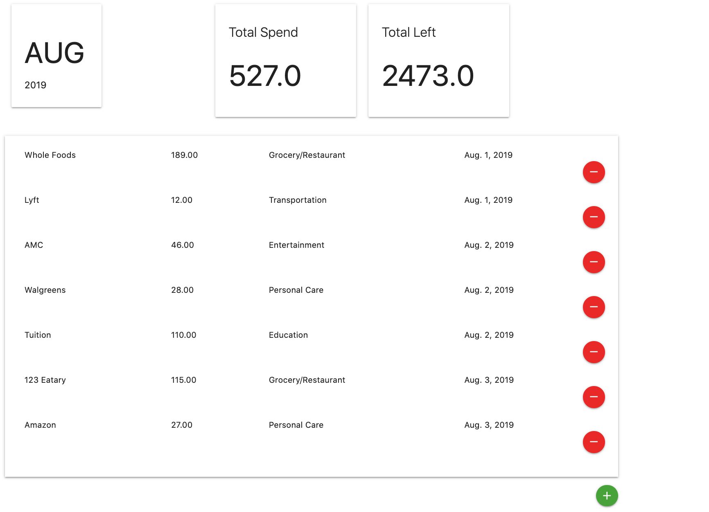
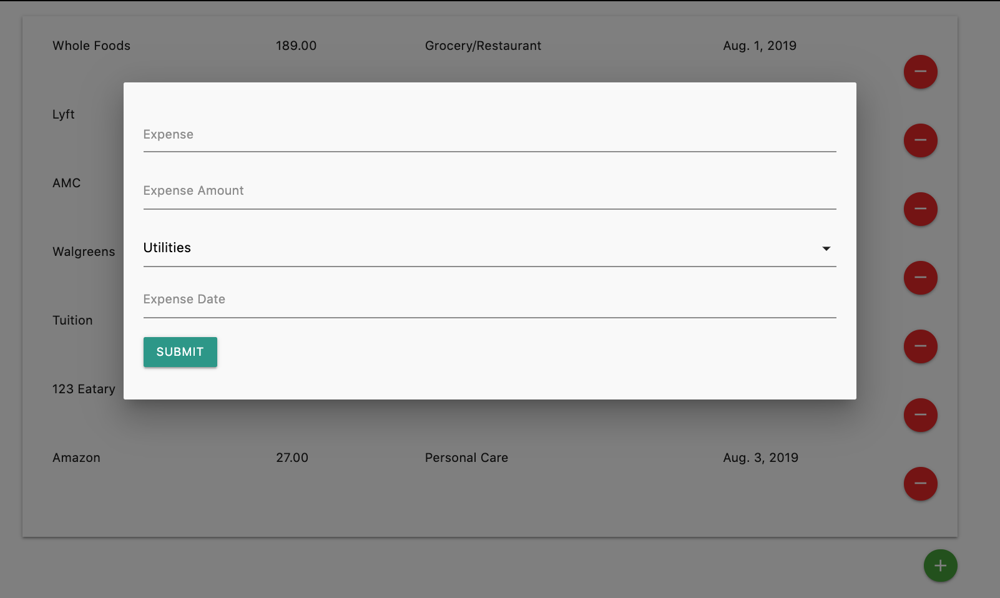
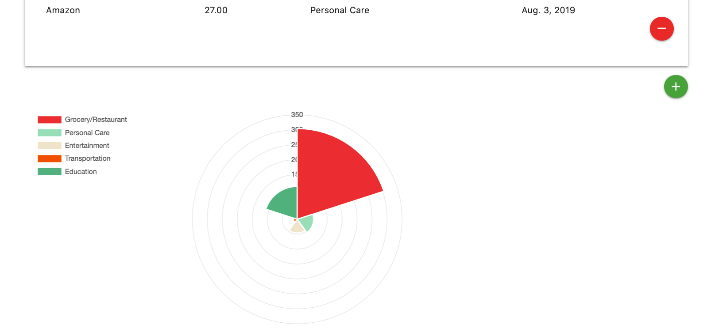

## Main Implementation

- Expense Stats section to show `Total Expense`, `Total Budget Left` for the current month 
   
- Expense Display section to `Display` ordered expenses for the current month, `Add` expense using pop-up **Modal**, and `Delete` expenses 
   
- Expense Chart section to show expense totals for each category using **Polar Area Chart** 
   

## Next Steps

- Add in Bar Chart to display monthly expense totals for the past year
- Add in Log-In page

## Main Language/Framework Used

- [Django](https://www.djangoproject.com/)
- [Materialize](https://materializecss.com/)
- [Chart.js](https://www.chartjs.org/)
